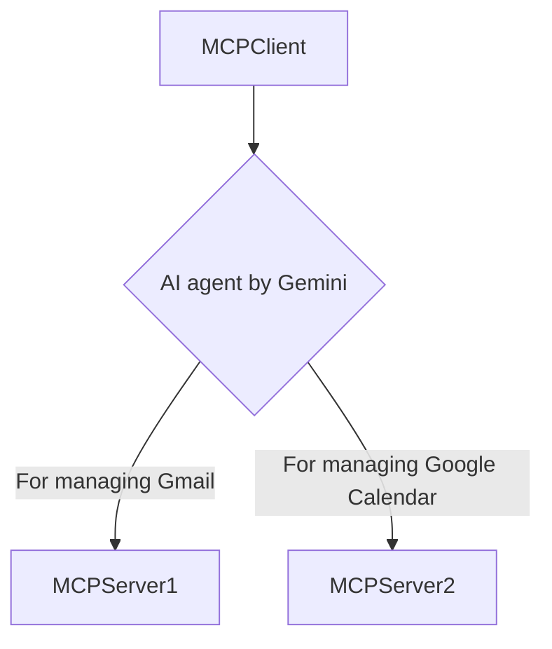
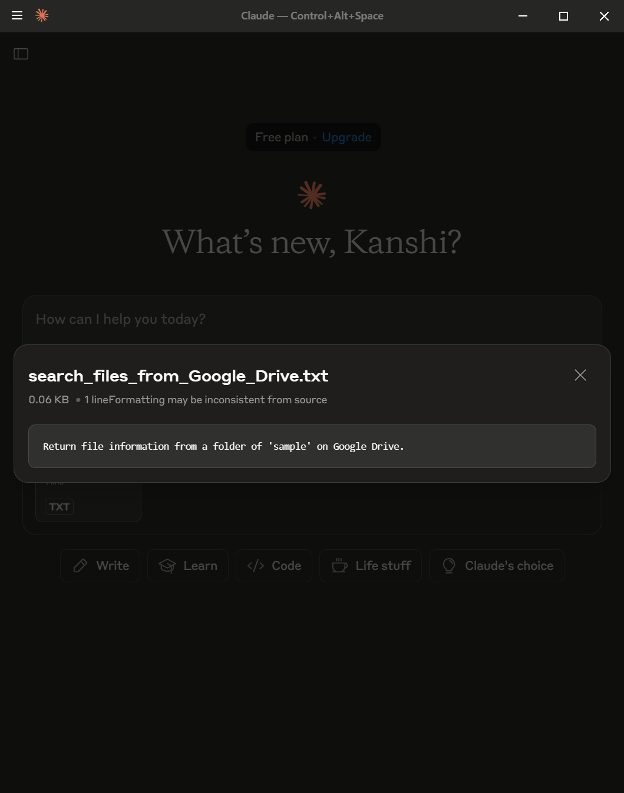

# MCPApp

<a name="top"></a>
[](LICENCE)

[](https://mseep.ai/app/tanaikech-mcpapp)

<a name="overview"></a>


# Overview

The Model Context Protocol (MCP) acts as a universal adapter, letting AI securely access external data. A new Google Apps Script-based MCP network enables AI to interact with Google Workspace (e.g., Docs, Calendar) using existing permissions. This cloud-native solution simplifies integration for rapid prototyping and internal tools.

# Description

The Model Context Protocol (MCP) is an emerging standard designed to function as a universal adapter, enabling AI applications to seamlessly and securely connect with external systems and data sources. The core purpose of MCP is to provide a standardized method for AI models to request and receive contextually relevant information, which is crucial for performing complex tasks.

A previous version of this repository successfully demonstrated the feasibility of implementing an MCP server using Google Apps Script. This proof-of-concept confirmed that an Apps Script-based server can allow an AI to securely access, manipulate, and leverage data within Google Workspace services. For instance, it enables an AI agent to summarize a specified Google Doc, find available slots in a user's Google Calendar, or extract data from a Google Sheet, all through a standardized request-response cycle operating within the user's existing security permissions.

The updated version of this repository advances this concept by exploring a complete, end-to-end MCP network built entirely on Google Apps Script. In this architecture, both the MCP servers (which fulfill requests) and the MCP client (which initiates requests on behalf of the AI) are implemented as Google Apps Script web apps. This creates a powerful, self-contained network that operates exclusively within the Google Cloud ecosystem, leveraging Google's native infrastructure for communication and authentication. This "cloud-native" bond eliminates the need for external servers and simplifies credential management.

While this approach is subject to the inherent platform limitations of Google Apps Script, such as execution time limits (e.g., 6 minutes for standard accounts) and API quotas, its value is significant for specific use cases. It is particularly well-suited for rapid prototyping, internal enterprise tools, and user-centric applications where individuals can act as their own data custodians, securely exposing their Workspace data to trusted AI agents without third-party data handling. Ultimately, this successful demonstration underscores the strong demand for deeper AI-Google Workspace integration and makes a compelling case for the development of a dedicated, official SDK to support MCP, which would offer the performance, reliability, and robust features required to unlock its full potential.

# Flow

The flow chart of this sample is as follows.



# ToolsForMCPServer

**The tools for the MCP server can be obtained at [ToolsForMCPServer](https://github.com/tanaikech/ToolsForMCPServer).** The combination of MCPApp and ToolsForMCPServer will be useful.

# Usage

## 1. Create Google Apps Script Projects

To test the MCP network built with Google Apps Script, we'll aim to achieve the following:

**Confirm emails in Gmail, apply relevant labels, create Google Calendar events from those emails, and reply to specific ones. Additionally, we'll save the IDs of processed emails to prevent duplicates in subsequent runs. This entire process will run automatically on a regular basis.**

To accomplish this, we'll utilize both an MCP client and MCP servers:

- **MCPClient:** This client will be automatically triggered by a time-driven event.
- **MCPServer1:** Manages Gmail operations.
- **MCPServer2:** Manages Google Calendar operations.

**Please create a new Google Sheet and two standalone Google Apps Script projects.** [Ref](https://developers.google.com/apps-script/guides/projects#create-standalone)

Once created, open the script editors for the Google Sheet and both Google Apps Script projects.

## 2. Install a library

### Repository

[https://github.com/tanaikech/MCPApp](https://github.com/tanaikech/MCPApp)

### Library's project key

```
1TlX_L9COAriBlAYvrMLiRFQ5WVf1n0jChB6zHamq2TNwuSbVlI5sBUzh
```

In order to simply build the MCP network with Google Apps Script, I created the script as a Google Apps Script library. To use this library, please install the library as follows.

1. Open the script editor. In this case, please install this library on both the MCP client and the MCP servers.
2. [Install this library](https://developers.google.com/apps-script/guides/libraries): The library's project key is **`1TlX_L9COAriBlAYvrMLiRFQ5WVf1n0jChB6zHamq2TNwuSbVlI5sBUzh`**.

## 3. Scripts

You can see the whole script, including the library, at my repository. [https://github.com/tanaikech/MCPApp](https://github.com/tanaikech/MCPApp)

The sample scripts are as follows: Please copy and paste the following scripts for each script editor and save the script. `MCPApp` is an identifier of the installed library.

If you directly copy the demo files to your Google Drive, the following script can also be used. Please copy and paste the following script into the script editor of Google Apps Script and run the function `myFunction`. By this, the demo files are copied to your Google Drive.

```javascript
function myFunction() {
  const dstFolderId = "root"; // Please set your destination folder ID. The default is the root folder.

  // These file IDs are the sample client and servers.
  const fileIds = [
    "11gazbixLhyZFs_SFXjKFBDPDOu0zGT4XzOORgKSF6Qw", // MCPClient_demo",
    "14jtSnPbx7njQvXAdiVMlekLvCWR84F06XF3q2hZ3EvME3lyzwAriFe-t", // MCPServer1_demo: For Gmail",
    "1RnKQJnZNI3kGOvB3mLmZjn-E9AH8700tptLPYcUqebaOqHBh71mRFT57", // MCPServer2_demo: For Google Calendar"
  ];

  const folder = DriveApp.getFolderById(dstFolderId);
  const headers = { authorization: "Bearer " + ScriptApp.getOAuthToken(), "Content-Type": "application/json" };
  const reqs = fileIds.map(fileId => ({
    url: `https://www.googleapis.com/drive/v3/files/${fileId}/copy`,
    headers,
    payload: JSON.stringify({ parents: [dstFolderId], name: DriveApp.getFileById(fileId).getName() })
  }));
  UrlFetchApp.fetchAll(reqs).forEach(res => {
    const { id } = JSON.parse(res.getContentText());
    DriveApp.getFileById(id).moveTo(folder);
  });

  //  If an error is related to Drive API, please enable Drive API v3 at Advanced Google services.
}
```

When you test the demo script by manually creating the files, please check the following steps.

### 1. MCPClient

Please copy and paste the following script to the script editor of Google Sheets of "MCPClient". And, please set your API key for using the Gemini API. And, set your Web Apps URLs to `mcpServerUrls`.

[https://github.com/tanaikech/MCPApp/blob/master/MCPClient.js](https://github.com/tanaikech/MCPApp/blob/master/MCPClient.js)

In the current stage, it seems that the batck process can be used with the MCP server. MCPApp can also use the batch process. When `batchProcess: true` is used in the object for the `client` method, the batch process is used. This might be able to reduce the process cost a little.

### 2. MCPServer1: For Gmail

Please copy and paste the following script to the script editor of "MCPServer1". In this sample, the MCP server has no AI agent. So, you can use the sample script of the MCP server without modification.

[https://github.com/tanaikech/MCPApp/blob/master/MCPServer1.js](https://github.com/tanaikech/MCPApp/blob/master/MCPServer1.js)

### 3. MCPServer2: For Google Calendar

Please copy and paste the following script to the script editor of "MCPServer2". In this sample, the MCP server has no AI agent. So, you can use the sample script of the MCP server without modification.

[https://github.com/tanaikech/MCPApp/blob/master/MCPServer2.js](https://github.com/tanaikech/MCPApp/blob/master/MCPServer2.js)

### Another approach

Of course, you can use this library by directly copying and pasting it into your script editor. In that case, please copy and paste the script of this library. And modify as follows. And also, please copy and paste [GeminiWithFiles](https://github.com/tanaikech/GeminiWithFiles/blob/master/classGeminiWithFiles.js).

```javascript
return new MCPApp.mcpApp({ accessKey: "sample" })
  .setServices({ lock: LockService.getScriptLock() })
  .server(object);
```

to

```javascript
return new MCPApp({ accessKey: "sample" })
  .setServices({ lock: LockService.getScriptLock() })
  .server(object);
```

## 4. Deploy Web Apps

To allow access from the MCP client, the projects for the MCP servers use Web Apps built with Google Apps Script. [Ref](https://developers.google.com/apps-script/guides/web) The MCP client can access the MCP server using an HTTP POST request. Thus, the Web Apps can be used as the MCP server.

Detailed information can be found in [the official documentation](https://developers.google.com/apps-script/guides/web#deploy_a_script_as_a_web_app).

Please follow these steps to deploy the Web App in the script editor.

1. In the script editor, at the top right, click "Deploy" -> "New deployment".
2. Click "Select type" -> "Web App".
3. Enter the information about the Web App in the fields under "Deployment configuration".
4. Select **"Me"** for **"Execute as"**.
5. Select **"Only myself"** for **"Who has access to the app:"**. In this case, the MCP client requests the MCP server using the access token in the request header. And, no users except for you can access the Web Apps in this setting. If you want to use the MCP servers with the outside of the Google, please set this to "Anyone".
6. Click "Deploy".
7. On the script editor, at the top right, click "Deploy" -> "Test deployments".
8. Please run the function `getServerURL()` of each server, and copy the Web Apps URL of each server. These Web Apps URLs are used in the MCP client.

In the MCP network built by Google Apps Script, the MCP client requests each MCP server with the access token. By this, the server side can save the detailed logs in the console. [Ref](https://github.com/tanaikech/taking-advantage-of-Web-Apps-with-google-apps-script?tab=readme-ov-file#logs-in-web-apps-for-google-apps-script) This might also be one of the advantages of the MCP network built by Google Apps Script.

## 5. Testing

Before running the MCP client, please confirm that your **API key** has been entered into `apiKey` and the **Web App URLs** of the MCP servers have been entered into `mcpServerUrls`. Once confirmed, manually run `mcpClient`. This will open the authorization dialog. Please authorize the necessary scopes.

When `mcpClient` runs, the script performs the following actions:

**It confirms emails in Gmail, applies relevant labels, creates Google Calendar events from those emails, and replies to specific ones. Additionally, it saves the IDs of processed emails to prevent duplicates in subsequent runs. When the time-driven trigger is used, this entire process will run automatically on a regular basis.**

The first time you run `mcpClient`, it retrieves emails from 30 minutes ago until the current time. In subsequent runs, it retrieves emails from the time of the previous run until the current time.

To automate the execution of this function, you can install a time-driven trigger on `mcpClient`. For more information, refer to [Manage Triggers Manually](https://developers.google.com/apps-script/guides/triggers/installable#manage_triggers_manually). Alternatively, if you prefer to manage time-driven triggers programmatically, my library [TriggerApp](https://github.com/tanaikech/TriggerApp) might also be helpful.

When I tested it, the following result was obtained. I could confirm that the MCP client achieved the goal using the 2 MCP servers.

```
* Retrieved message IDs of processed emails from Google Sheets: ###ID1###, ###ID2###.
* Retrieved new emails from Gmail since 2025-06-12 00:00:00, excluding processed ones.
* Identified one new email:
    * **Thread ID**: ###ID2###
    * **Title**: "Hi"
    * **From**: Sample user
    * **Body**: "Hello. Let's go to lunch together tomorrow. What would you like to eat?"
* Applied the label "temp" to the new email.
* Created a draft reply for message ID ###ID2###:
    * **Content**: "Thanks for the lunch invitation! I'm looking forward to it. I'm pretty flexible, but if I had to choose, I'm always happy with seafood or soba noodles. Let me know what you're thinking! See you tomorrow."
    * **Draft URL**: [https://URL](https://URL)
* Created a calendar event:
    * **Title**: "Lunch with Sample user"
    * **Time**: 2025-06-13 12:00:00-13:00:00
    * **Description**: "Let's go to lunch together tomorrow."
* Added message ID ###ID2### to Google Sheets.
```

### Additional information

- If no new emails are found in your Gmail during a demo script run, the script will stop due to `check_process: true`. To continue, please send some emails to your account and rerun the script. The script will then run to completion once new emails are detected in Gmail. I believe this mid-process stop is a crucial feature of MCPApp.

### Logging

The following logging options are available in this library.

If you want to see the logs between the MCP client and the MCP server, please use the following script. Please prepare a sample Spreadsheet and set the Spreadsheet ID to `spreadsheetId`. Doing this will create a "Log" sheet in the Spreadsheet, and the logs will be stored there. This will be useful for understanding the communication between the MCP client and the MCP server.

For MCP client

```javascript
const m = new MCPApp.mcpApp({
  accessKey: "sample",
  log: true,
  spreadsheetId: "###",
}) // Here
  .client(object);
```

For MCP server

```javascript
return new MCPApp.mcpApp({
  accessKey: "sample",
  log: true,
  spreadsheetId: "###",
}) // Here
  .setServices({ lock: LockService.getScriptLock() })
  .server(object);
```

### Use MCP servers as libraries

In the case of MCPApp, the MCP servers built by Google Apps Script can also be used as the libraries. The sample script is as follows. In this sample, it supposes that the above 2 MCP servers have already been used.

#### Deploy Library

Deploy the Google Apps Script projects for the MCP servers as the library. [Ref](https://developers.google.com/apps-script/guides/libraries#create_and_share_a_library)

#### Client side

Install the libraries of MCP servers to the script editor of the MCP client. The sample script for using this is as follows. By this, the MCP servers are directly used with the MCP client. In this case, the process cost might be able to be reduced a little.

```javascript
const object = {
  apiKey: "###",
  prompt: "###",
  mcpServerObj: [MCPServer1.items, MCPServer2.items],
};
const m = new MCPApp.mcpApp().client(object);
```

# Summary

- This updated repository confirms that it advances the concept of a **Multi-Cloud Proxy (MCP) network** by presenting a complete, end-to-end solution built entirely on **Google Apps Script**.
- When this MCP network is used, Google's resources can be accessed safely using an **access token**.
- It's anticipated that this MCP network will also be able to manage various more complex tasks.

# Note

- You can modify the prompt of the MCP client and the MCP servers. By this, you can adjust the MCP network to your situation.

# Sample scripts

## 1. Simple usage of MCP server

You might have a case where you are required to simply test the MCP server. At that time, the following sample script might be useful.

```javascript
function doPost(eventObject) {
  const functions = {
    params_: {
      function_name1: {
        description: "Use this for testing a tool 1 of MCP server.",
        parameters: {
          type: "object",
          properties: { sample: { type: "string", description: "Sample value." } },
          required: ["sample"]
        }
      },
      function_name2: {
        description: "Use this for testing a tool 2 of MCP server.",
        parameters: {
          type: "object",
          properties: { sample: { type: "string", description: "Sample value." } },
          required: ["sample"]
        },
      }
    },

    function_name1: (object) => object,
    function_name2: (object) => object,
  };

  const items = [
    {
      "type": "initialize",
      "value": {
        "protocolVersion": "2025-06-18",
        "capabilities": { "tools": { "listChanged": false }, "prompts": { listChanged: false } },
        "serverInfo": { "name": "sample_gas_web_apps", "version": "0.0.1" }
      }
    },
    ...Object.keys(functions.params_).map(f => (
      {
        "type": "tools/list",
        "function": functions[f],
        "value": {
          name: f,
          description: functions.params_[f].description,
          inputSchema: functions.params_[f].parameters,
        }
      })),

    {
      "type": "prompts/list",
      "value": {
        "prompts": [
          {
            name: "custom1",
            description: "Custom 1",
            arguments: [
              { name: "sample1", description: "sample1", required: true },
            ],
          },
          {
            name: "custom2",
            description: "Custom 2",
            arguments: [
              { name: "sample2", description: "sample2", required: true },
            ],
          },
        ]
      }
    },

    {
      "type": "prompts/get",
      "value": {
        "custom1": {
          description: "Custom1",
          messages: [
            {
              role: "user",
              content: {
                type: "text",
                text: "Custom1",
              },
            },
          ],
        },
        "custom2": {
          description: "Custom2",
          messages: [
            {
              role: "user",
              content: {
                type: "text",
                text: "Custom2",
              },
            },
          ],
        },
      }
    },
  ];

  const object = { eventObject, items };
  return new MCPApp
    .mcpApp({ accessKey: "sample" })
    .setServices({ lock: LockService.getScriptLock() })
    .server(object);
}
```

When [Gemini CLI](https://github.com/google-gemini/gemini-cli) is used, please modify `settings.json` as follows.

```json
{
  "theme": "Default",
  "selectedAuthType": "###",
  "mcpServers": {
    "gas_web_apps": {
      "command": "npx",
      "args": [
        "mcp-remote",
        "https://script.google.com/macros/s/###/exec?accessKey=sample"
      ],
      "env": {}
    }
  }
}
```

When the above sample MCP server has been correctly deployed, the following result is obtained.


<details>
# Additional information

If you want to test the MCP servers using the MCP client except for Google Apps Script, for example, when Claude Desktop is used, the following steps can be used.

## 1. Prepare for testing: Claude Desktop

In this case, it is required to redeploy the Web Apps as `Execute as: Me` and `Who has access to the app: Anyone` and get the Web Apps URLs like`https://script.google.com/macros/s/###/exec`.

To test this Web App, Claude Desktop is used. [Ref](https://claude.ai/download) In this case, the `claude_desktop_config.json` is configured as follows. Please replace `https://script.google.com/macros/s/###/exec` with your Web App URL.

In this sample, a value of `sample` is used as an access key for accessing the Web App. In the current stage, it seems that to use the MCP server through the HTTP request with Claude Desktop, `mcp-remote` is required to be used.

```json
{
  "mcpServers": {
    "gas_web_apps": {
      "command": "npx",
      "args": [
        "mcp-remote",
        "https://script.google.com/macros/s/###/exec?accessKey=sample"
      ],
      "env": {}
    }
  }
}
```

I could also test the MCP server with the Web Apps using Copilot for Visual Studio Code. In that case, the following setting is used.

```
"mcp": {
  "inputs": [],
  "servers": {
    "gas_web_apps": {
      "command": "npx",
      "args": [
        "mcp-remote",
        "https://script.google.com/macros/s/###/exec?accessKey=sample"
      ],
      "env": {}
    }
  }
}
```

## 2. Testing

When Claude Desktop is run, you can see that `gas_web_apps` of the MCP server is installed as follows.


The function `search_files_on_Google_Drive` is called by the `tools/call` method from the MCP client.


The function `search_schedule_on_Google_Calendar` is called by the `tools/call` method from the MCP client.


The function `search_files_from_Google_Drive` is called by the `prompts/get` method from the MCP client.



The function `get_today_schedule` is called by the `resources/read` method from the MCP client. In this sample, the 3 events above are loaded.


# Samples

## Image Transfer: MCP Server (Web Apps/Google Apps Script) to MCP Client (Gemini/Python)

This sample script sends image data to the MCP client. The original post of this is from [https://medium.com/google-cloud/image-transfer-mcp-server-web-apps-google-apps-script-to-mcp-client-gemini-python-1fb22eb89dd2](https://medium.com/google-cloud/image-transfer-mcp-server-web-apps-google-apps-script-to-mcp-client-gemini-python-1fb22eb89dd2).

```javascript
/**
 * This function retrieves an image by searching Google Drive.
 *
 * This function is run by "tools/call".
 * "tools/call": The function name is required to be the same as the name declared at "tools/list".
 */
function get_image(args) {
  const { filename } = args;
  let result;
  try {
    const files = DriveApp.searchFiles(
      `title contains '${filename}' and mimeType contains 'image' and trashed=false`
    );
    if (files.hasNext()) {
      const file = files.next();
      result = {
        content: [
          {
            type: "text",
            text: `Actual filename on Google Drive is ${file.getName()}.`,
          },
          {
            type: "image",
            data: Utilities.base64Encode(file.getBlob().getBytes()),
            mimeType: file.getMimeType(),
          },
        ],
        isError: false,
      };
    } else {
      result = {
        content: [{ type: "text", text: `There is no file of "${filename}".` }],
        isError: true,
      };
    }
  } catch (err) {
    result = { content: [{ type: "text", text: err.message }], isError: true };
  }
  return { jsonrpc: "2.0", result };
}

/**
 * Please set and modify the following JSON to your situation.
 * The key is the method from the MCP client.
 * The value is the object for returning to the MCP client.
 * ID is automatically set in the script.
 * The specification of this can be seen in the official document.
 * Ref: https://modelcontextprotocol.io/specification/2025-03-26
 */
function getserverResponse_() {
  return {
    /**
     * Response to "initialize"
     */
    initialize: {
      jsonrpc: "2.0",
      result: {
        protocolVersion: "2024-11-05", // or "2025-03-26"
        capabilities: {
          experimental: {},
          prompts: {
            listChanged: false,
          },
          resources: {
            subscribe: false,
            listChanged: false,
          },
          tools: {
            listChanged: false,
          },
        },
        serverInfo: {
          name: "sample server from MCPApp",
          version: "1.0.0",
        },
      },
    },

    /**
     * Response to "tools/list"
     */
    "tools/list": {
      jsonrpc: "2.0",
      result: {
        tools: [
          {
            name: "get_image", // <--- It is required to create a function of the same name as this.
            description: "Get image from Google Drive.",
            inputSchema: {
              type: "object",
              properties: {
                filename: {
                  description: "Get image of this filename from Google Drive.",
                  type: "string",
                },
              },
              required: ["filename"],
            },
          },
        ],
      },
    },
  };
}

/**
 * "tools/call": The function name is required to be the same as the name declared at "tools/list".
 * "resources/read": The function name is required to be the same as the uri declared at "resources/list".
 */
function getFunctions_() {
  return { "tools/call": { get_image } };
}

/**
 * This function is automatically run when the MCP client accesses Web Apps.
 */
function doPost(eventObject) {
  const object = {
    eventObject,
    serverResponse: getserverResponse_(),
    functions: getFunctions_(),
  };
  return new MCPApp.mcpApp({ accessKey: "sample" })
    .setServices({ lock: LockService.getScriptLock() })
    .server(object);
}
```

# Note

- About `protocolVersion`, when it is different between the MCP client and the MCP server, an error occurs. For example, in the current stage, Claude Desktop v0.9.3 uses `protocolVersion` of `2024-11-05`. Under this condition, when the MCP server returns `protocolVersion` of `2025-03-26` to the initialize method, no response is returned from the client.
- About `result.content` for returning the response from a function, the type of response value depends on the client side. For example, in the case of Claude Desktop, when the type of `array` is used, an error like `Unsupported content type: array`. This might be resolved in the future update.
- When a large data is sent to the MCP client (Claude Deskop, an error like `result exceeds maximum length of 1048576` occurs. So, please be careful when you send the data to the MCP client. But this might be resolved in the future update.

</details>

---

<a name="licence"></a>

# Licence

[MIT](LICENCE)

<a name="author"></a>

# Author

[Tanaike](https://tanaikech.github.io/about/)

[Donate](https://tanaikech.github.io/donate/)

<a name="updatehistory"></a>

# Update History

- v1.0.0 (May 8, 2025)

  1. Initial release.

- v1.0.1 (May 9, 2025)

  1. A bug in the logging was removed.

- v1.0.2 (May 29, 2025)

  1. From v1.0.2, in order to use MCPApp as a library, LockService is given.

- v2.0.0 (June 12, 2025)

  1. From v2.0.0, both the MCP client and the MCP server can be built by Google Apps Script.

- v2.0.1 (June 18, 2025)

  1. A bug was removed.

- v2.0.2 (June 19, 2025)

  1. A bug was removed.

- v2.0.3 (July 1, 2025)

  1. A bug was removed.

- v2.0.4 (July 2, 2025)

  1. A bug was removed.

- v2.0.5 (July 31, 2025)

  1. A bug was removed.

- v2.0.6 (August 1, 2025)

  1. "prompts/get" method was updated.

[TOP](#top)
