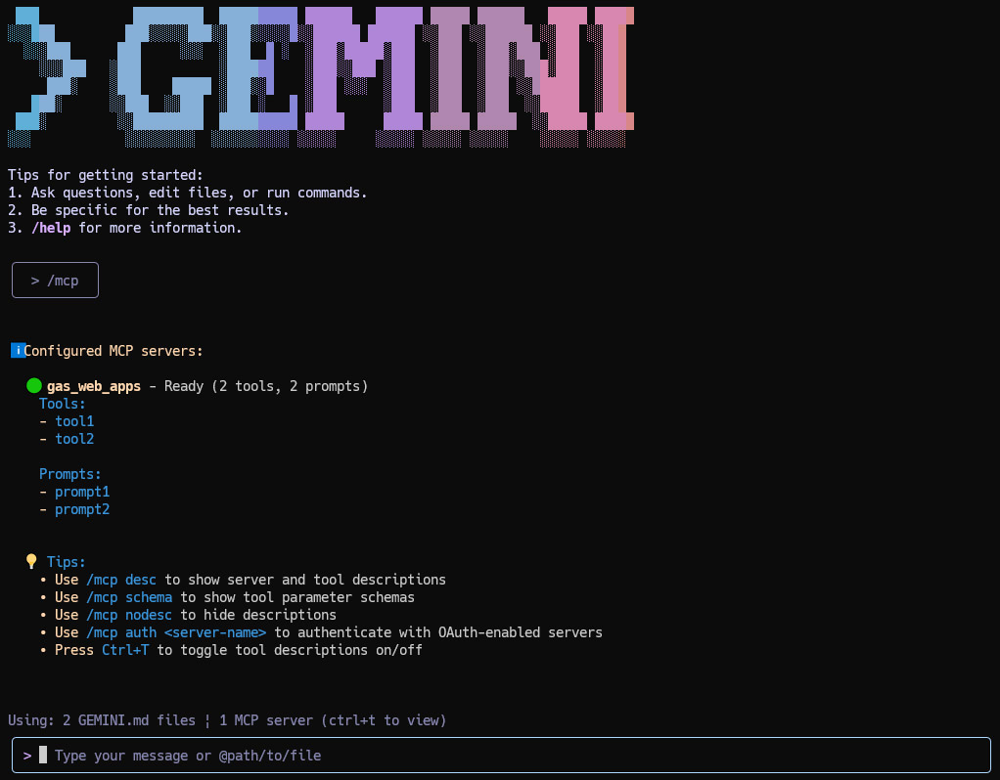

# MCP server

# Overview

Here, it introduces the MCP server for Gemini CLI and other MCP clients.

# Usage

## 1. Create a Google Apps Script Project

First, create a new standalone Google Apps Script project. A standalone project is not bound to a specific Google Sheet, Doc, or Form, making it ideal for creating a general-purpose web service. You can create one by visiting [script.google.com](https://script.google.com/home/projects/create). [Ref](https://developers.google.com/apps-script/guides/projects#create-standalone)

## 2. Install Libraries

To simplify building the MCP server, we will use pre-built Google Apps Script libraries. These encapsulate the complex MCP handling logic and provide ready-to-use tools, keeping the main script clean.

This sample uses two Google Apps Script libraries:

1.  **[MCPApp](https://github.com/tanaikech/MCPApp)**: Manages the MCP server lifecycle and communication protocols.
2.  **[ToolsForMCPServer](https://github.com/tanaikech/ToolsForMCPServer)**: Provides a suite of pre-built tools for interacting with Google Workspace services (Gmail, Drive, Calendar, etc.).

### Library Project Keys and Installation

1.  Open the script editor of the project you just created.
2.  **Install MCPApp**:
    - [Installation Guide](https://developers.google.com/apps-script/guides/libraries)
    - Project Key: `1TlX_L9COAriBlAYvrMLiRFQ5WVf1n0jChB6zHamq2TNwuSbVlI5sBUzh`
    - Identifier: `MCPApp`
    - Repository: [https://github.com/tanaikech/MCPApp](https://github.com/tanaikech/MCPApp)
3.  **Install ToolsForMCPServer**:
    - [Installation Guide](https://developers.google.com/apps-script/guides/libraries)
    - Project Key: `1lnE7UL1jQgPDbTB9yjhiwZM0SaS9MObhzvWUWb_t8FisO6A3bLepvM2j`
    - Identifier: `ToolsForMCPServer`
    - Repository: [https://github.com/tanaikech/ToolsForMCPServer](https://github.com/tanaikech/ToolsForMCPServer)

## 3. Script

### MCP server with tools of ToolsForMCPServer

Please copy and paste the following script into the script editor (replacing any existing code) and save the project.

This is a basic script for using this library.

```javascript
const apiKey = "###"; // API key for Gemini API

/**
 * This function is automatically run when the MCP client accesses Web Apps.
 */
const doPost = (e) => main(e);

function main(eventObject) {
  const m = ToolsForMCPServer;

  m.apiKey = apiKey; // This is an API key for using Gemini API.
  // m.defaultCalendarId = "###"; // If you want to use the specific calendar, please use this.

  const object = { eventObject, items: m.getTools() };
  return new MCPApp.mcpApp({ accessKey: "sample" })
    .setServices({ lock: LockService.getScriptLock() })
    .server(object);
}
```

The tools and prompts are provided by ToolsForMCPServer.

**Note:**

- If you intend to use the following tools, you must uncomment the `apiKey` line in the script and provide a valid API key for the Gemini API.
  - generate_roadmap_to_google_sheets: Creates a roadmap in Google Sheets.
  - generate_description_on_google_drive: Generates and sets a description for a file on Google Drive.
  - generate_image_on_google_drive: Generates an image from a prompt and saves it to Google Drive.
  - summarize_file_on_google_drive: Summarizes a file stored on Google Drive.
  - description_web_site: Provides descriptions of websites given their URLs.
- If an error related to Drive API occurred, please enable Drive API at Advanced Google services.
- **If you want to manage Docs, Sheets, Slides, and Calendars using the batch update methods of API, please enable Docs API, Sheets API, Slides API, and Calendar API at Advanced Google services.**
- If you want to use the specific Google Calendar, please set `defaultCalendarId`.

- Starting with v2.0.7, you can now selectively enable or disable the **LockService**.
  - By default, this library runs with the LockService enabled. To disable it, simply modify `return new MCPApp.mcpApp({ accessKey: "sample" })` to `return new MCPApp.mcpApp({ accessKey: "sample", lock: false })`.
  - When the LockService is disabled (`lock: false`), asynchronous requests from clients like the Gemini CLI may see an increase in processing speed. However, it's important to note that the maximum number of concurrent requests must not exceed 30. Please use this option with caution.

### MCP server with ToolsForMCPServer and your custom tools and prompts

You might want to add your custom tools and promts to the MCP server. At that time, please refer to the following script.

If you are required to add only tools, please remove `prompts/list` and `prompts/get` from `itemsForMCP`.
If you are required to add only prompts, please remove `tools/list` from `itemsForMCP`.

```javascript
/**
 * If you want to add your custom tools, please use the following script.
 * This is a simple sample. Please modify the following script to your situation.
 */
function getCustomTools() {
  const functions = {
    params_: {
      tool1: {
        description: "Use this for testing a tool 1 of MCP server.",
        parameters: {
          type: "object",
          properties: {
            sample: { type: "string", description: "Sample value." },
          },
          required: ["sample"],
        },
      },
      tool2: {
        description: "Use this for testing a tool 2 of MCP server.",
        parameters: {
          type: "object",
          properties: {
            sample: { type: "string", description: "Sample value." },
          },
          required: ["sample"],
        },
      },
    },

    tool1: (object) => object,
    tool2: (object) => object,
  };

  // for MCP
  const itemsForMCP = [
    ...Object.keys(functions.params_).map((f) => ({
      type: "tools/list",
      function: functions[f],
      value: {
        name: f,
        description: functions.params_[f].description,
        inputSchema: functions.params_[f].parameters,
      },
    })),

    {
      type: "prompts/list",
      value: {
        prompts: [
          {
            name: "prompt1",
            description: "Custom prompt 1",
            arguments: [
              { name: "sample1", description: "sample1", required: true },
            ],
          },
          {
            name: "prompt2",
            description: "Custom prompt 2",
            arguments: [
              { name: "sample2", description: "sample2", required: true },
            ],
          },
        ],
      },
    },

    {
      type: "prompts/get",
      value: {
        prompt1: {
          description: "Custom prompt 1",
          messages: [
            {
              role: "user",
              content: {
                type: "text",
                text: "Custom prompt 1",
              },
            },
          ],
        },
        prompt2: {
          description: "Custom prompt 2",
          messages: [
            {
              role: "user",
              content: {
                type: "text",
                text: "Custom prompt 2",
              },
            },
          ],
        },
      },
    },
  ];

  return itemsForMCP;
}

const apiKey = "###"; // API key for Gemini API

/**
 * This function is automatically run when the MCP client accesses Web Apps.
 */
const doPost = (e) => main(e);

function main(eventObject) {
  const m = ToolsForMCPServer;
  m.apiKey = apiKey;
  const object = { eventObject, items: [...m.getTools(), ...getCustomTools()] };
  return new MCPApp.mcpApp({ accessKey: "sample" })
    .setServices({ lock: LockService.getScriptLock() })
    .server(object);
}
```

### MCP server with your custom tools and prompts

You might have a case where you are required to simply test the MCP server. At that time, the following sample script might be useful.

```javascript
function doPost(eventObject) {
  const functions = {
    params_: {
      tool1: {
        description: "Use this for testing a tool 1 of MCP server.",
        parameters: {
          type: "object",
          properties: {
            sample: { type: "string", description: "Sample value." },
          },
          required: ["sample"],
        },
      },
      tool2: {
        description: "Use this for testing a tool 2 of MCP server.",
        parameters: {
          type: "object",
          properties: {
            sample: { type: "string", description: "Sample value." },
          },
          required: ["sample"],
        },
      },
    },

    tool1: (object) => object,
    tool2: (object) => object,
  };

  const items = [
    {
      type: "initialize",
      value: {
        protocolVersion: "2025-06-18",
        capabilities: {
          tools: { listChanged: false },
          prompts: { listChanged: false },
        },
        serverInfo: { name: "sample_gas_web_apps", version: "0.0.1" },
      },
    },
    ...Object.keys(functions.params_).map((f) => ({
      type: "tools/list",
      function: functions[f],
      value: {
        name: f,
        description: functions.params_[f].description,
        inputSchema: functions.params_[f].parameters,
      },
    })),

    {
      type: "prompts/list",
      value: {
        prompts: [
          {
            name: "prompt1",
            description: "Custom prompt 1",
            arguments: [
              { name: "sample1", description: "sample1", required: true },
            ],
          },
          {
            name: "prompt2",
            description: "Custom prompt 2",
            arguments: [
              { name: "sample2", description: "sample2", required: true },
            ],
          },
        ],
      },
    },

    {
      type: "prompts/get",
      value: {
        prompt1: {
          description: "Custom prompt 1",
          messages: [
            {
              role: "user",
              content: {
                type: "text",
                text: "Custom prompt 1",
              },
            },
          ],
        },
        prompt2: {
          description: "Custom prompt 2",
          messages: [
            {
              role: "user",
              content: {
                type: "text",
                text: "Custom prompt 2",
              },
            },
          ],
        },
      },
    },
  ];

  const object = { eventObject, items };
  return new MCPApp.mcpApp({ accessKey: "sample" })
    .setServices({ lock: LockService.getScriptLock() })
    .server(object);
}
```

When [Gemini CLI](https://github.com/google-gemini/gemini-cli) is used, please modify `settings.json` as follows.

```json
{
  "theme": "Default",
  "selectedAuthType": "gemini-api-key",
  "mcpServers": {
    "gas_web_apps": {
      "command": "npx",
      "args": [
        "mcp-remote",
        "https://script.google.com/macros/s/###/exec?accessKey=sample"
      ],
      "env": {}
    }
  },
  "disableAutoUpdate": true
}
```

or

```json
{
  "theme": "Default",
  "selectedAuthType": "###",
  "mcpServers": {
    "gas_web_apps": {
      "httpUrl": "https://script.google.com/macros/s/###/exec?accessKey=sample",
      "description": "MCP server built by Google Apps Script Web Apps"
    }
  }
}
```

- `"gas_web_apps"`: A local identifier for your server.
- `"httpUrl"`: Your Web Apps URL. In the current stage, when this is used, an error might occur. At that time, use `mcp-remote`.
- If you use `mcp-remote`, please install it. [Ref](https://www.npmjs.com/package/mcp-remote)

When the above sample MCP server has been correctly deployed, the following result is obtained.



### Show all tools

When this script is run, all tools in this library are shown as a JSON object.

```javascript
function showAlltools() {
  const res = ToolsForMCPServer.getToolList();
  console.log(res);
}
```

### Filter tools

When you want to use the specific tools, you can also use the following script.

This script uses only the tool `get_exchange_rate`.

```javascript
function main(eventObject) {
  const enables = ["get_exchange_rate"];

  const m = ToolsForMCPServer;
  m.apiKey = apiKey;
  const object = { eventObject, items: m.getTools({ enables }) };
  return new MCPApp.mcpApp({ accessKey: "sample" })
    .setServices({ lock: LockService.getScriptLock() })
    .server(object);
}
```

This script uses all tools except for the tool `get_exchange_rate`.

```javascript
function main(eventObject) {
  const disables = ["get_exchange_rate"];

  const m = ToolsForMCPServer;
  m.apiKey = apiKey;
  const object = { eventObject, items: m.getTools({ disables }) };
  return new MCPApp.mcpApp({ accessKey: "sample" })
    .setServices({ lock: LockService.getScriptLock() })
    .server(object);
}
```

## 4. Deploy Web Apps

To allow the Gemini CLI to communicate with our script, we must deploy it as a Web App. This creates a unique URL that acts as our MCP server endpoint.

You can find detailed information in [the official documentation](https://developers.google.com/apps-script/guides/web#deploy_a_script_as_a_web_app).

Please follow these steps to deploy the Web App in the script editor:

1.  In the script editor, at the top right, click **Deploy** -> **New deployment**.
2.  Click **Select type** -> **Web App**.
3.  Enter a description for the Web App in the fields under **Deployment configuration**.
4.  Select **"Me"** for **"Execute as"**. This is crucial, as it allows the script to run with your permissions to access your Google services.
5.  Select **"Anyone"** for **"Who has access"**. This makes the URL callable from the internet. Access is controlled by the unguessable URL and the `accessKey` defined in the script.
6.  Click **Deploy**.
7.  After authorizing the necessary scopes, copy the **Web app URL**. It will look similar to `https://script.google.com/macros/s/###/exec`. This is your MCP server endpoint.

**Important:** When you modify the Apps Script code, you must create a new deployment version to publish the changes. Click **Deploy** > **Manage deployments**, select your active deployment, click the pencil icon, and choose **"New version"** from the Version dropdown. [More info here](https://github.com/tanaikech/taking-advantage-of-Web-Apps-with-google-apps-script?tab=readme-ov-file#redeploy).

## Preparing Gemini CLI

### 1. Install Gemini CLI

Follow the official documentation to install the Gemini CLI on your system. [Ref](https://github.com/google-gemini/gemini-cli)

### 2. Modify `settings.json`

To connect the Gemini CLI to your new Apps Script server, you need to edit its settings file. This file is typically located at `~/.gemini/settings.json` on macOS/Linux or `%USERPROFILE%\.gemini\settings.json` on Windows.

Add the `mcpServers` configuration block as shown below.

1.  Replace `https://script.google.com/macros/s/###/exec` with the Web App URL you copied earlier.
2.  Ensure the `accessKey` query parameter matches the `accessKey` you defined in your Google Apps Script (`sample` in this example).

```json
{
  "theme": "Default",
  "selectedAuthType": "###",
  "mcpServers": {
    "gas_web_apps": {
      "command": "npx",
      "args": [
        "mcp-remote",
        "https://script.google.com/macros/s/###/exec?accessKey=sample"
      ],
      "env": {}
    }
  }
}
```

- `"gas_web_apps"`: A local identifier for your server.
- `"command"` and `"args"`: These tell the Gemini CLI how to invoke the `mcp-remote` tool, which handles the communication with your Web App URL.

When you have never installed `mcp-remote`, please install it. [Ref](https://www.npmjs.com/package/mcp-remote)
