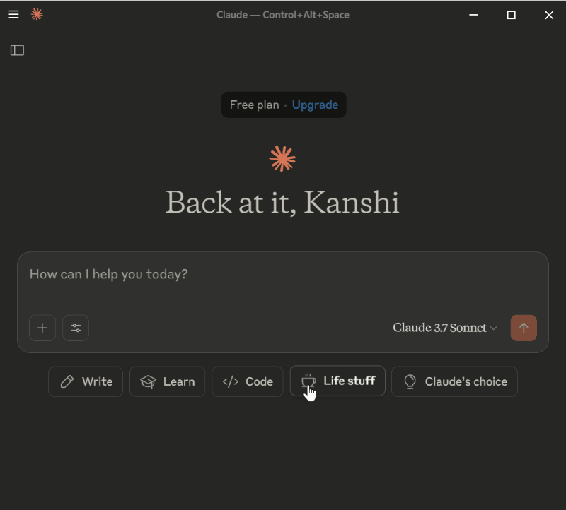
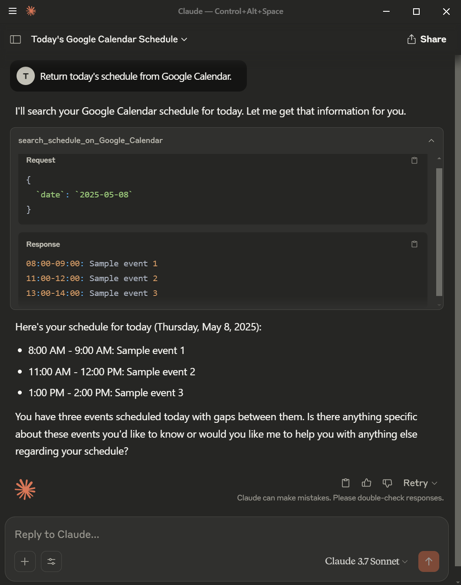
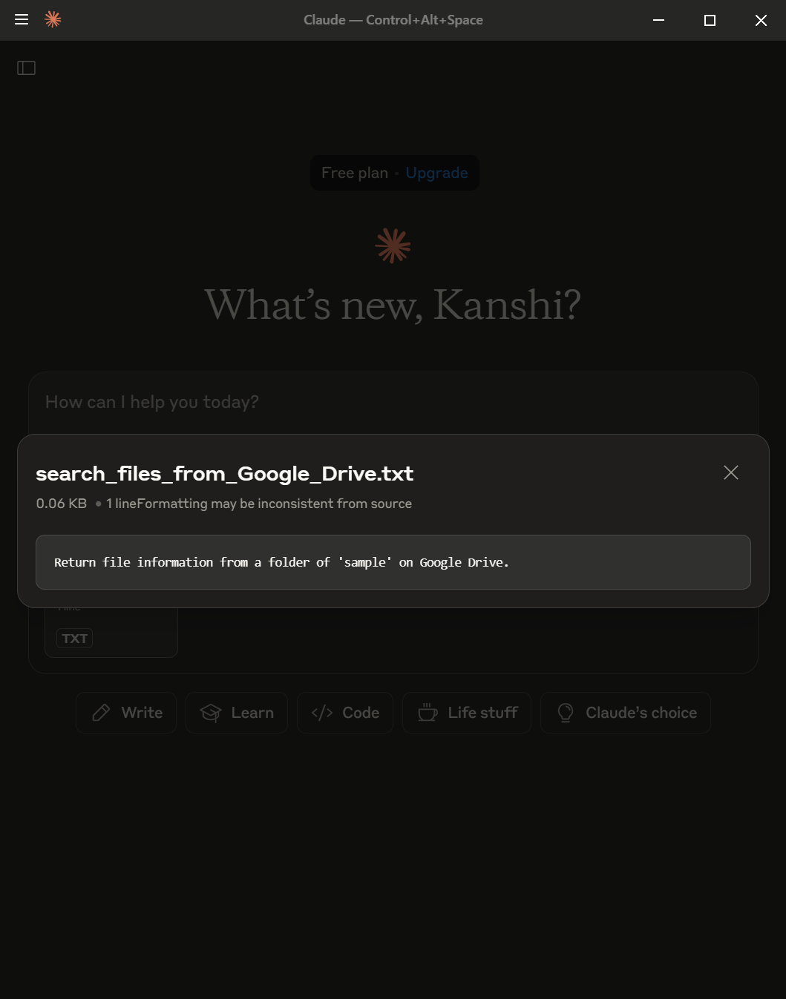

# MCPApp

[](https://mseep.ai/app/tanaikech-mcpapp)

<a name="top"></a>
[](LICENCE)

<a name="overview"></a>


# Overview

This text introduces the Model Context Protocol (MCP) for AI interaction, exploring Google Apps Script (GAS) as a server option. It shows feasibility with a sample but notes the lack of a GAS SDK, aiming to encourage understanding and development.

# Description

The Model Context Protocol (MCP) is an emerging standard acting as a universal adapter for connecting AI applications with external systems and data. This text explores the feasibility of implementing an MCP server using Google Apps Script. Doing so could enable AI to securely access and leverage data within Google Workspace services like Docs, Sheets, and Calendar via a standardized protocol, facilitating AI-powered workflows. A sample script demonstrates this potential despite the lack of an official Google Apps Script SDK. While platform limitations exist, this approach could be valuable for internal or user-centric applications, potentially encouraging dedicated SDK development for deeper AI-Google Workspace integration.

# Usage

## 1. Create a Google Apps Script project

Please create a Google Apps Script project of the standalone type. [Ref](https://developers.google.com/apps-script/guides/projects#create-standalone) Of course, the sample script in this report can also be used for the container-bound script type.

Open the script editor of the created Google Apps Script project.

## 2. Install a library

### Repository

[https://github.com/tanaikech/MCPApp](https://github.com/tanaikech/MCPApp)

### Library's project key

```
1TlX_L9COAriBlAYvrMLiRFQ5WVf1n0jChB6zHamq2TNwuSbVlI5sBUzh
```

In order to simply deploy the MCP server, I created the script as a Google Apps Script library. To use this library, please install the library as follows.

1. Create a GAS project: You can use this library for the GAS project of both the standalone type and the container-bound script type.
2. [Install this library](https://developers.google.com/apps-script/guides/libraries): The library's project key is **`1TlX_L9COAriBlAYvrMLiRFQ5WVf1n0jChB6zHamq2TNwuSbVlI5sBUzh`**.

## 3. Script

You can see the whole script, including the library, at my repository. [https://github.com/tanaikech/MCPApp](https://github.com/tanaikech/MCPApp)

The sample script is as follows: Please copy and paste the following script into the script editor and save the script. `MCPApp` is an identifier of the installed library.

In this sample script, "Tools", "Resources", and "Prompts" are implemented. At "Tools" and "Resources", the response value is created from Google Drive and Google Calendar using the functions and returned to the MCP client.

**From v1.0.2, in order to use MCPApp as a library, LockService is given.**

```javascript
/**
 * This function is automatically run when the MCP client accesses Web Apps.
 */
function doPost(eventObject) {
  const object = {
    eventObject,
    serverResponse: getserverResponse_(),
    functions: getFunctions_(),
  };
  return new MCPApp.mcpApp({ accessKey: "sample" }).setServices({ lock: LockService.getScriptLock() }).server(object);
}
```

The function `getserverResponse_()` is as follows. Please check the comment.

```javascript
/**
 * Please set and modify the following JSON to your situation.
 * The key is the method from the MCP client.
 * The value is the object for returning to the MCP client.
 * ID is automatically set in the script.
 * The specification of this can be seen in the official document.
 * Ref: https://modelcontextprotocol.io/specification/2025-03-26
 */
function getserverResponse_() {
  return {
    /**
     * Response to "initialize"
     */
    initialize: {
      jsonrpc: "2.0",
      result: {
        protocolVersion: "2024-11-05", // or "2025-03-26"
        capabilities: {
          experimental: {},
          prompts: {
            listChanged: false,
          },
          resources: {
            subscribe: false,
            listChanged: false,
          },
          tools: {
            listChanged: false,
          },
        },
        serverInfo: {
          name: "sample server from MCPApp",
          version: "1.0.0",
        },
      },
    },

    /**
     * Response to "tools/list"
     */
    "tools/list": {
      jsonrpc: "2.0",
      result: {
        tools: [
          {
            name: "search_files_on_Google_Drive", // <--- It is required to create a function of the same name as this.
            description: "Search files on Google Drive.",
            inputSchema: {
              type: "object",
              properties: {
                folderName: {
                  description:
                    "Search files in the folder of this folder name.",
                  type: "string",
                },
              },
              required: ["folderName"],
            },
          },
          {
            name: "search_schedule_on_Google_Calendar", // <--- It is required to create a function of the same name as this.
            description: "Search the schedule on Google Calendar.",
            inputSchema: {
              type: "object",
              properties: {
                date: {
                  description:
                    "Search the schedule on Google Calendar by giving the date.",
                  type: "string",
                  format: "date",
                },
              },
              required: ["date"],
            },
          },
        ],
      },
    },

    /**
     * Response to "resources/list"
     */
    "resources/list": {
      jsonrpc: "2.0",
      result: {
        resources: [
          {
            uri: "get_today_schedule", // <--- It is required to create a function of the same name as this.
            name: "today_schedule",
            description: "Today's schedule for Tanaike.",
            mimeType: "text/plain",
          },
        ],
        nextCursor: "next-page-cursor",
      },
    },

    /**
     * Response to "prompts/list"
     */
    "prompts/list": {
      jsonrpc: "2.0",
      result: {
        prompts: [
          {
            name: "search_files_from_Google_Drive",
            description:
              "Search files in the specific folder on Google Drive using tools.",
            arguments: [
              {
                name: "search_files",
                description: "Search files.",
                required: true,
              },
            ],
          },
        ],
        nextCursor: "next-page-cursor",
      },
    },

    /**
     * Response to "prompts/get"
     */
    "prompts/get": {
      jsonrpc: "2.0",
      result: {
        description: "Search files in the specific folder on Google Drive.",
        messages: [
          {
            role: "user",
            content: {
              type: "text",
              text: "Return file information from a folder of 'sample' on Google Drive.",
            },
          },
        ],
      },
    },
  };
}
```

The function `getFunctions_()` is as follows. Please check the comment. These functions are run when the MCP client calls `tools/call` and `resources/read`.

```javascript
/**
 * "tools/call": The function name is required to be the same as the name declared at "tools/list".
 * "resources/read": The function name is required to be the same as the uri declared at "resources/list".
 */
function getFunctions_() {
  return {
    "tools/call": {
      search_files_on_Google_Drive,
      search_schedule_on_Google_Calendar,
    },
    "resources/read": { get_today_schedule },
  };
}
```

Here, `search_files_on_Google_Drive`, `search_schedule_on_Google_Calendar`, and `get_today_schedule` are the functions. The function name is required to be the same as the name declared at "tools/list" and the uri declared at "resources/list". Also, the format of the return value is required to follow the specification of MCP. This is the specification of this script.

The functions are as follows.

```javascript
/**
 * This function retrieves the file metadata from the specific folder on Google Drive.
 *
 * This function is run by "tools/call".
 * "tools/call": The function name is required to be the same as the name declared at "tools/list".
 */
function search_files_on_Google_Drive(args) {
  const { folderName } = args;
  try {
    const res = [];
    const folders = DriveApp.getFoldersByName(folderName);
    while (folders.hasNext()) {
      const folder = folders.next();
      const files = folder.getFiles();
      while (files.hasNext()) {
        const file = files.next();
        res.push({ filename: file.getName(), mimeType: file.getMimeType() });
      }
    }
    const text = res
      .map(
        ({ filename, mimeType }) =>
          `Filename is ${filename}. MimeType is ${mimeType}.`
      )
      .join("\n");
    return {
      jsonrpc: "2.0",
      result: { content: [{ type: "text", text }], isError: false },
    };
  } catch (err) {
    return {
      jsonrpc: "2.0",
      result: { content: [{ type: "text", text: err.message }], isError: true },
    };
  }
}

/**
 * This function retrieves events from the specific date on Google Calendar.
 *
 * This function is run by "tools/call".
 * "tools/call": The function name is required to be the same as the name declared at "tools/list".
 */
function search_schedule_on_Google_Calendar(args) {
  const { date } = args;
  try {
    const start = new Date(date);
    start.setHours(0, 0, 0, 0);
    const end = new Date(start);
    end.setDate(start.getDate() + 1);
    const events = CalendarApp.getDefaultCalendar().getEvents(start, end); // or CalendarApp.getCalendarById("###").getEvents(start, end);
    const timeZone = Session.getScriptTimeZone();
    const text = events
      .map(
        (e) =>
          `${Utilities.formatDate(
            e.getStartTime(),
            timeZone,
            "HH:mm"
          )}-${Utilities.formatDate(
            e.getEndTime(),
            timeZone,
            "HH:mm"
          )}: ${e.getTitle()}`
      )
      .join("\n");
    return {
      jsonrpc: "2.0",
      result: { content: [{ type: "text", text }], isError: false },
    };
  } catch (err) {
    return {
      jsonrpc: "2.0",
      result: { content: [{ type: "text", text: err.message }], isError: true },
    };
  }
}

/**
 * This function retrieves today's events on Google Calendar.
 *
 * This function is run by "resources/read".
 * "resources/read": The function name is required to be the same as the uri declared at "resources/list".
 */
function get_today_schedule() {
  const start = new Date();
  start.setHours(0, 0, 0, 0);
  const end = new Date(start);
  end.setDate(start.getDate() + 1);
  const events = CalendarApp.getDefaultCalendar().getEvents(start, end); // or CalendarApp.getCalendarById("###").getEvents(start, end);
  const timeZone = Session.getScriptTimeZone();
  const contents = events.map((e) => ({
    uri: e.getTitle(),
    mimeType: "text/plain",
    text: `${Utilities.formatDate(
      e.getStartTime(),
      timeZone,
      "HH:mm"
    )}-${Utilities.formatDate(
      e.getEndTime(),
      timeZone,
      "HH:mm"
    )}: ${e.getTitle()}`,
  }));
  return { jsonrpc: "2.0", result: { contents } };
}
```

This is a simple sample. This script can be tested. But, if you want to create your MCP server, please modify and create the value of `serverResponse`, and the functions to your situation.

### Another approach

Of course, you can use this library by directly copying and pasting it into your script editor. In that case, please copy and paste the script of this library. And modify as follows.

```javascript
return new MCPApp.mcpApp({ accessKey: "sample" }).setServices({ lock: LockService.getScriptLock() }).server(object);
```

to

```javascript
return new MCPApp({ accessKey: "sample" }).server(object);
```

## 4. Web Apps

To allow access from the MCP client, the project uses Web Apps built with Google Apps Script. [Ref](https://developers.google.com/apps-script/guides/web) The MCP client can access the MCP server using an HTTP POST request. Thus, the Web Apps can be used as the MCP server.

Detailed information can be found in [the official documentation](https://developers.google.com/apps-script/guides/web#deploy_a_script_as_a_web_app).

Please follow these steps to deploy the Web App in the script editor.

1. In the script editor, at the top right, click "Deploy" -> "New deployment".
2. Click "Select type" -> "Web App".
3. Enter the information about the Web App in the fields under "Deployment configuration".
4. Select **"Me"** for **"Execute as"**.
5. Select **"Anyone"** for **"Who has access to the app:"**. In this sample, a simple approach allows requests without an access token. However, a custom API key is used for accessing the Web App.
6. Click "Deploy".
7. On the script editor, at the top right, click "Deploy" -> "Test deployments".
8. Copy the Web App URL. It will be similar to `https://script.google.com/macros/s/###/exec`.

**It is important to note that when you modify the Google Apps Script for the Web App, you must modify the deployment as a new version.** This ensures the modified script is reflected in the Web App. Please be careful about this. Also, you can find more details on this in my report "[Redeploying Web Apps without Changing URL of Web Apps for new IDE](https://gist.github.com/tanaikech/ebf92d8f427d02d53989d6c3464a9c43)".

## 5. Prepare for testing: Claude Desktop

To test this Web App, Claude Desktop is used. [Ref](https://claude.ai/download) In this case, the `claude_desktop_config.json` is configured as follows. Please replace `https://script.google.com/macros/s/###/exec` with your Web App URL.

In this sample, a value of `sample` is used as an access key for accessing the Web App. In the current stage, it seems that to use the MCP server through the HTTP request with Claude Desktop, `mcp-remote` is required to be used.

```json
{
  "mcpServers": {
    "gas_web_apps": {
      "command": "npx",
      "args": [
        "mcp-remote",
        "https://script.google.com/macros/s/###/exec?accessKey=sample"
      ],
      "env": {}
    }
  }
}
```

I could also test the MCP server with the Web Apps using Copilot for Visual Studio Code. In that case, the following setting is used.

```
"mcp": {
  "inputs": [],
  "servers": {
    "gas_web_apps": {
      "command": "npx",
      "args": [
        "mcp-remote",
        "https://script.google.com/macros/s/###/exec?accessKey=sample"
      ],
      "env": {}
    }
  }
}
```

## 6. Testing

When Claude Desktop is run, you can see that `gas_web_apps` of the MCP server is installed as follows.


The function `search_files_on_Google_Drive` is called by the `tools/call` method from the MCP client.



The function `search_schedule_on_Google_Calendar` is called by the `tools/call` method from the MCP client.



The function `search_files_from_Google_Drive` is called by the `prompts/get` method from the MCP client.



The function `get_today_schedule` is called by the `resources/read` method from the MCP client. In this sample, the 3 events above are loaded.


# Options

## 1. Logging

The following logging options are available in this library.

If you want to see the logs between the MCP client and the MCP server, please use the following script. Please prepare a sample Spreadsheet and set the Spreadsheet ID to `spreadsheetId`. Doing this will create a "Log" sheet in the Spreadsheet, and the logs will be stored there. This will be useful for understanding the communication between the MCP client and the MCP server.

```javascript
/**
 * This function is automatically run when the MCP client accesses Web Apps.
 */
function doPost(eventObject) {
  const spreadsheetId = "###"; // Please set the Spreadsheet ID.

  const object = {
    eventObject,
    serverResponse: getserverResponse_(),
    functions: getFunctions_(),
  };
  return new MCPApp.mcpApp({
    accessKey: "sample",
    log: true,
    spreadsheetId,
  })
  .setServices({ lock: LockService.getScriptLock() })
  .server(object);
}
```

# Samples

## Image Transfer: MCP Server (Web Apps/Google Apps Script) to MCP Client (Gemini/Python)

This sample script sends image data to the MCP client. The original post of this is from [https://medium.com/google-cloud/image-transfer-mcp-server-web-apps-google-apps-script-to-mcp-client-gemini-python-1fb22eb89dd2](https://medium.com/google-cloud/image-transfer-mcp-server-web-apps-google-apps-script-to-mcp-client-gemini-python-1fb22eb89dd2).

```javascript
/**
 * This function retrieves an image by searching Google Drive.
 *
 * This function is run by "tools/call".
 * "tools/call": The function name is required to be the same as the name declared at "tools/list".
 */
function get_image(args) {
  const { filename } = args;
  let result;
  try {
    const files = DriveApp.searchFiles(
      `title contains '${filename}' and mimeType contains 'image' and trashed=false`
    );
    if (files.hasNext()) {
      const file = files.next();
      result = {
        content: [
          {
            type: "text",
            text: `Actual filename on Google Drive is ${file.getName()}.`,
          },
          {
            type: "image",
            data: Utilities.base64Encode(file.getBlob().getBytes()),
            mimeType: file.getMimeType(),
          },
        ],
        isError: false,
      };
    } else {
      result = {
        content: [{ type: "text", text: `There is no file of "${filename}".` }],
        isError: true,
      };
    }
  } catch (err) {
    result = { content: [{ type: "text", text: err.message }], isError: true };
  }
  return { jsonrpc: "2.0", result };
}

/**
 * Please set and modify the following JSON to your situation.
 * The key is the method from the MCP client.
 * The value is the object for returning to the MCP client.
 * ID is automatically set in the script.
 * The specification of this can be seen in the official document.
 * Ref: https://modelcontextprotocol.io/specification/2025-03-26
 */
function getserverResponse_() {
  return {
    /**
     * Response to "initialize"
     */
    initialize: {
      jsonrpc: "2.0",
      result: {
        protocolVersion: "2024-11-05", // or "2025-03-26"
        capabilities: {
          experimental: {},
          prompts: {
            listChanged: false,
          },
          resources: {
            subscribe: false,
            listChanged: false,
          },
          tools: {
            listChanged: false,
          },
        },
        serverInfo: {
          name: "sample server from MCPApp",
          version: "1.0.0",
        },
      },
    },

    /**
     * Response to "tools/list"
     */
    "tools/list": {
      jsonrpc: "2.0",
      result: {
        tools: [
          {
            name: "get_image", // <--- It is required to create a function of the same name as this.
            description: "Get image from Google Drive.",
            inputSchema: {
              type: "object",
              properties: {
                filename: {
                  description: "Get image of this filename from Google Drive.",
                  type: "string",
                },
              },
              required: ["filename"],
            },
          },
        ],
      },
    },
  };
}

/**
 * "tools/call": The function name is required to be the same as the name declared at "tools/list".
 * "resources/read": The function name is required to be the same as the uri declared at "resources/list".
 */
function getFunctions_() {
  return { "tools/call": { get_image } };
}

/**
 * This function is automatically run when the MCP client accesses Web Apps.
 */
function doPost(eventObject) {
  const object = {
    eventObject,
    serverResponse: getserverResponse_(),
    functions: getFunctions_(),
  };
  return new MCPApp.mcpApp({ accessKey: "sample" }).setServices({ lock: LockService.getScriptLock() }).server(object);
}
```

# Note

- About `protocolVersion`, when it is different between the MCP client and the MCP server, an error occurs. For example, in the current stage, Claude Desktop v0.9.3 uses `protocolVersion` of `2024-11-05`. Under this condition, when the MCP server returns `protocolVersion` of `2025-03-26` to the initialize method, no response is returned from the client.
- About `result.content` for returning the response from a function, the type of response value depends on the client side. For example, in the case of Claude Desktop, when the type of `array` is used, an error like `Unsupported content type: array`. This might be resolved in the future update.
- When a large data is sent to the MCP client (Claude Deskop, an error like `result exceeds maximum length of 1048576` occurs. So, please be careful when you send the data to the MCP client. But this might be resolved in the future update.

---

<a name="licence"></a>

# Licence

[MIT](LICENCE)

<a name="author"></a>

# Author

[Tanaike](https://tanaikech.github.io/about/)

[Donate](https://tanaikech.github.io/donate/)

<a name="updatehistory"></a>

# Update History

- v1.0.0 (May 8, 2025)

  1. Initial release.

- v1.0.1 (May 9, 2025)

  1. A bug in the logging was removed.

- v1.0.2 (May 29, 2025)

  1. From v1.0.2, in order to use MCPApp as a library, LockService is given.

[TOP](#top)
